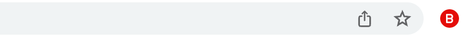

# Block Site

**Block Site** is a simple **Chrome/Firefox extension** that improves your productivity by blocking access to distracting websites as you specify.

## Icon





## Usage

Click on the icon. Enter sites to block. See [Special characters](#special-characters) and [Examples](#examples).

Choose how to resolve blocked: **Close Tab**, or **Show Blocked info page**.

**Blocked info page** shows what _url_ was blocked, based on which _rule_ it was blocked, and optionally a blocked count over a chosen period of time:
_All Time_, _This Month_, _This Week_, or _Today_.

### Special characters

```
! ⇒ prepend to exclude from blocking
* ⇒ match any zero or more characters
? ⇒ match any one character
```

### Examples

```
example.com              # Blocks example.com/ and any page on it


example.com/             # Blocks example.com/ ONLY
example.com/*            # Blocks example.com/ and any page on it


example.com/*            # Blocks any page on example.com/
!example.com/orange/     # except example.com/orange/


*.example.com/           # Blocks any subdomain of example.com/
!apple.example.com/      # except apple.example.com/


*watch*                  # Blocks any page containing word "watch"


example.com/????/*       # Blocks e.g.:
                         # - example.com/pear/projects/1
                         # - example.com/plum/projects/1


example.com/*rry/*       # Blocks e.g.:
                         # - example.com/cherry/projects/1
                         # - example.com/strawberry/projects/1
```

### Context menu

If enabled, Block Site will be added to your browser's context menu. It will offer options to:
- Block this page only
- Block entire website

## Privacy notice

Block Site doesn't collect any personal information or data.
Any user settings are stored in your browser only.
